# python_dataviz

## นายณัฐฤทธิ์ เศวตวรานนท์

## 603021863-3 Sc-SI 

### วิธีลง miniconda

1. ทำการค้นหาคำว่า "miniconda" 

2. กดเว็ปแรกของผลการค้นหา จะทำให้เข้าสู่หน้าเว็ป conda สามารถกดเข้าได้จากตรงนี้ >> [กดตรงนี้](https://docs.conda.io/en/latest/miniconda.html)

 3. ให้เลือกระบบปฏิบัติการที่ตรงกับเครื่องที่ท่านใช้งานอยู่ แล้วทำการดาวน์โหลดจะได้ดังภาพข้างล่าง

** วิธีดูระบบปฏิบัติการเบื้องต้น
[กดตรงนี้](https://support.brother.com/g/b/faqend.aspx?c=th&lang=th&prod=dcpt300_all&faqid=faq00002859_000) **

 

4. กด Next ไปเรื่อยๆแล้วทำการ install 

5. Anaconda ที่ติดตั้งเรียบร้อยจะอยู่ตรงรูปธงวินโดดังภาพสามารถกดค้นหาได้ในช่อง serch 

6. เปิด Anaconda ใส่ที่อยู่ของ folder โดยใช้คำสั่ง cd "ที่อยู่folder" ดั้งภาพ

7. ทำการติดตั้งpackageต่างๆ เช่น จะติดตั้งpackage pandas จะใช้คำสั่ง pip install pandas และกด Enter เพื่อรันpackage และหากสำเร็จจะขึ้นตามภาพ

8. ทำการเปิดหน้า jupyter notebook 
พิมคำสั่ง jupyter notebook เพื่อเข้าใช้งาน

9. เมื่อใช้คำสั่ง jupyter notebook จะเด้งเข้ามาหน้านี้ทันที

10. ทำการกด new เลือก Python 3

11. สามารถเข้าใช้งานเพื่อเขียนคำสั่งต่างๆได้ สามารถเปบี่ยนชื่อที่มุมซ้ายบนและบันทึกหรือใช้ฟังชั่นต่างๆได้ การกดรันโค้ตต้องกดshift+enter เท่านั้นหากกดแต่ enterจะเป็นการขึ้นบรรทัดใหม่

---------------------------------------

### วิธีการใช้งาน Colab 

1. ค้นหาพิมพ์คำว่า colab แล้วเลือกเข้าเว็ปหรือสามารถเข้าได้ตรงนี้ >> [กดตรงนี้](https://colab.research.google.com/) ทำการ sign in มุมขวาบนสีฟ้าให้เรียบร้อยเพื่อเข้าใช้งาน

2. เมื่อทำการเข้าสู่ระบบเสร็จสิ้นจะขึ้นหน้าจอดังภาพ ให้กดที่ File>>NewPython 3 notebook 

หากขึ้นดังภาพนี้ให้กดตรง NewPython 3 notebook ตัวหนังสือสีฟ้าได้เลย
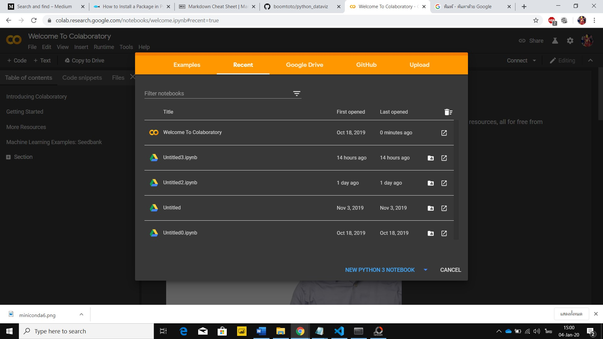

3.สามารถเข้าทำโค้ตได้เหมือน minicoda กด enter จะขึ้นบรรทัดใหม่จะไม่รันโค้ตให้ หากต้องการให้รันโค้ต ต้องกด shift+enter หรือกดเครื่องหมาย > เพื่อทำการรันโค้ต

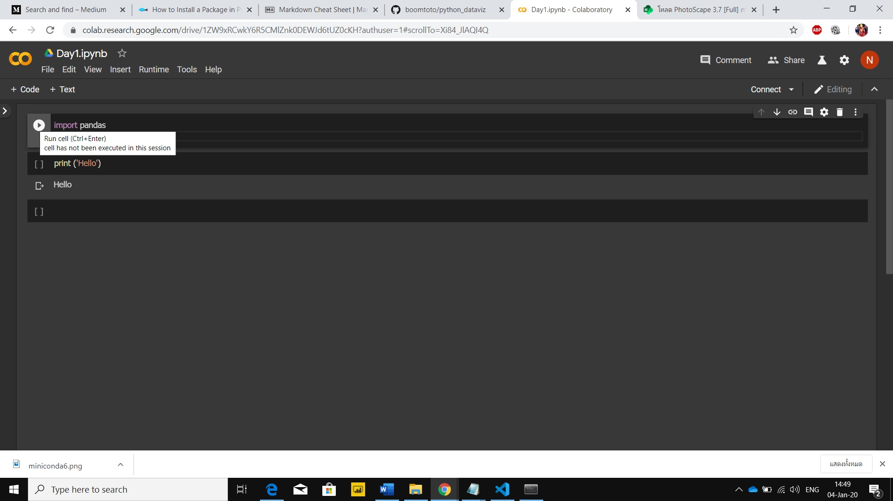

*** การเขียนในcolabคือการเขียนpythonผ่านหน้าเว็ป -ใช้อินเตอร์เน็ตตลอดเวลา

การเขียนในancondaคือการเขียนpythonในโปรแกรม - ใช้อินเตอร์เน็นตอนติดตั้งหรืออัพโหลด 

--------------------------

### วิธีการใช้งาน Github

1. ทำการเข้าเว็ปของทาง github
ทำการสมัครให้เรียบร้อยเพื่อเข้าใช้งาน
[กดตรงนี้](https://github.com/)

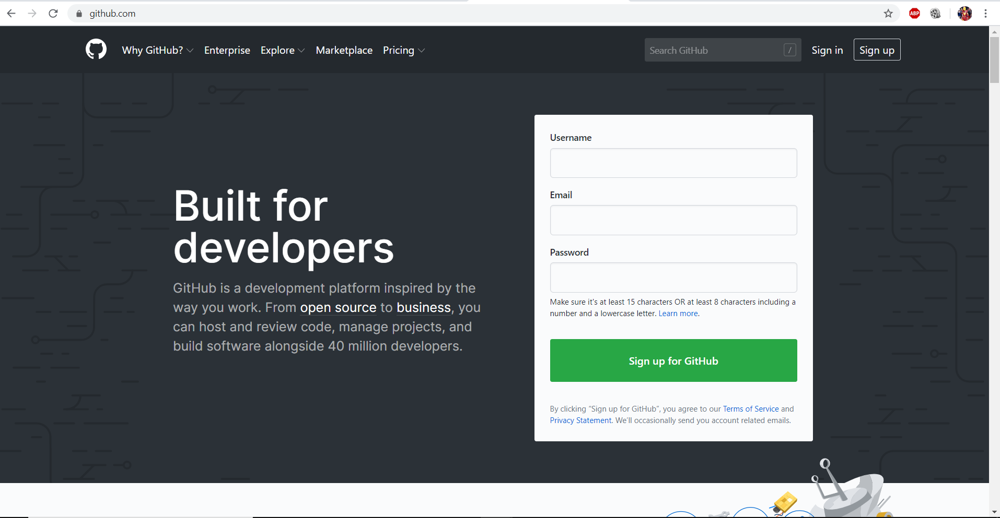
2. กด "New respository" ตามภาพเพื่อ create respository

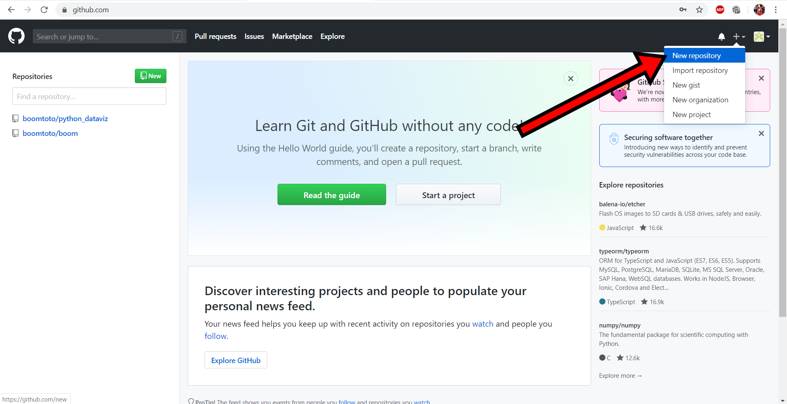

3. ทำการตั้งชื่อ กำหนดสิทธิผู้เข้าถึง และติ้กตามลูกศร และกด"Create repository"
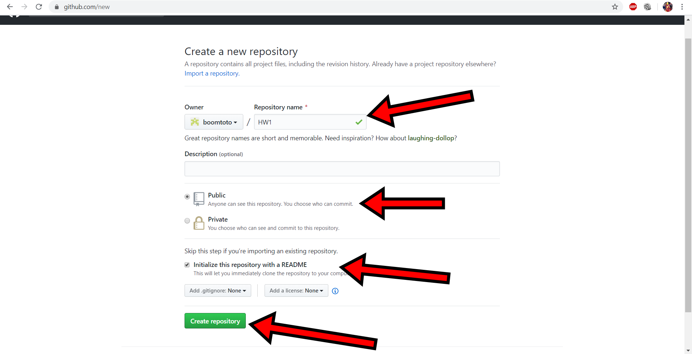

4. ทำการ clone ไฟล์ไปยัง Miniconda ด้วยการคัดลอก URL ตามภาพ
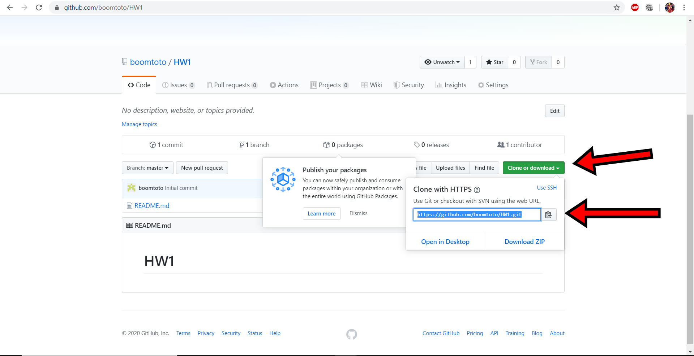

5. ทำการ clone ด้วยคำสั่ง git clone "URL ที่คัดลอกมา" 
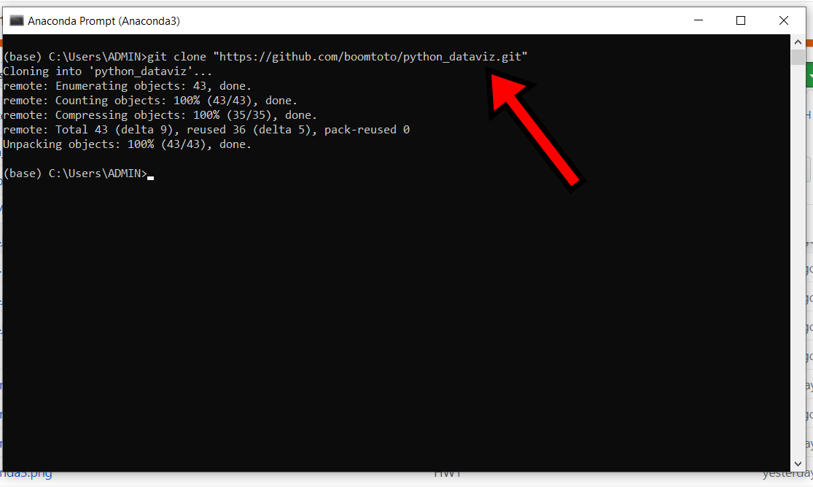
6. ทำการเชื่อมต่อไปยัง folder ด้วยคำสั่งcd "ที่อยู่folder" ดั้งภาพ
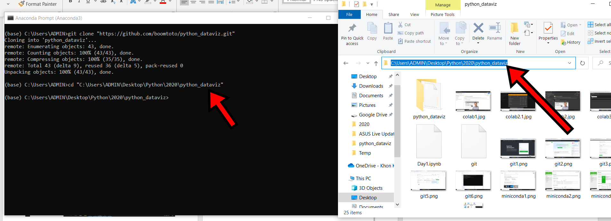

7. ใช้คำสั่ง code.เพื่อเปิดเข้าทำงานในโปรแกรม visual studio codeจะได้ตามภาพ
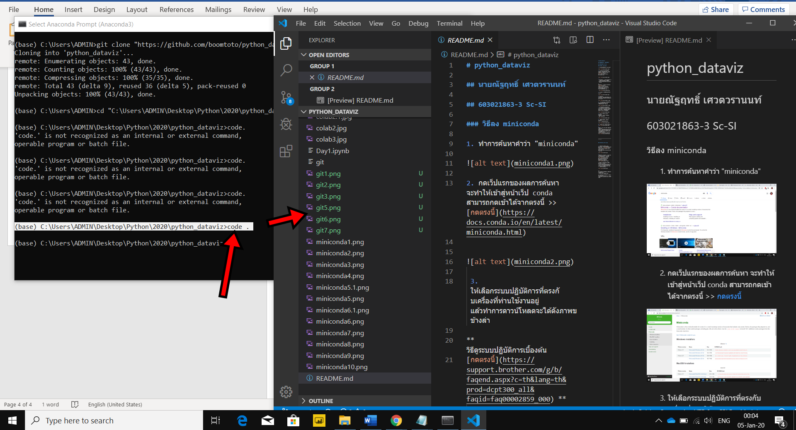

8. หลังจากทำการเขียนโค้ตลงไปเราจะมาตรวจสอบการเชื่อมต่อไปยัง git ด้วยคำสั่ง "git status"หากยังไม่มีการเชื่อมต่อจะเป็นตัวสีแดงดังภาพ

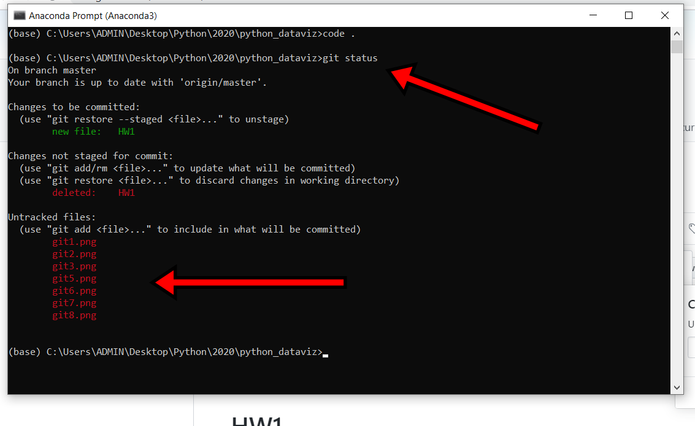

9. ทำการ add ด้วยคำสั่ง "git add ตามด้วยไฟล์" แล้วทำการ commit ด้วยคำสั่ง git commit -m"ชื่อที่ต้องการ" 
ทำการอัพโหลดไปยัง git โดยใช้คำสัง "git pus" โปรแกรมจะแสดงคำสั่งให้กรอกชื่อ usename และรหัสผ่านของเรา **การกรอกรหัสผ่านจะไม่แสดงตัวอักษรเวลาพิมพ์เพื่ออความปลอดภัย
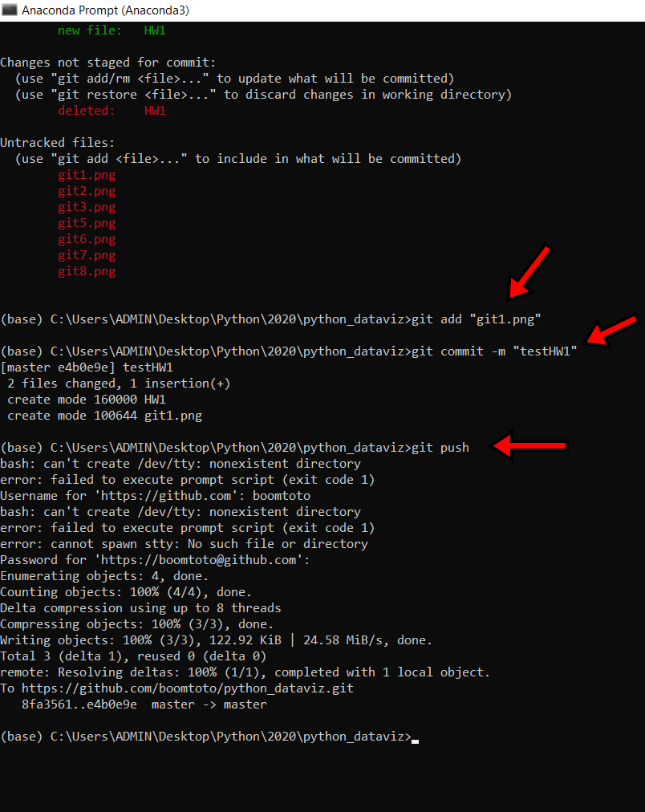

สามารถดูทริกการใช้งานต่างๆได้ที่ markdownguide
[กดตรงนี้](https://www.markdownguide.org/cheat-sheet/)

ติดตั้ง "visual studio code" 
[ติดตั้ง](https://code.visualstudio.com/)

