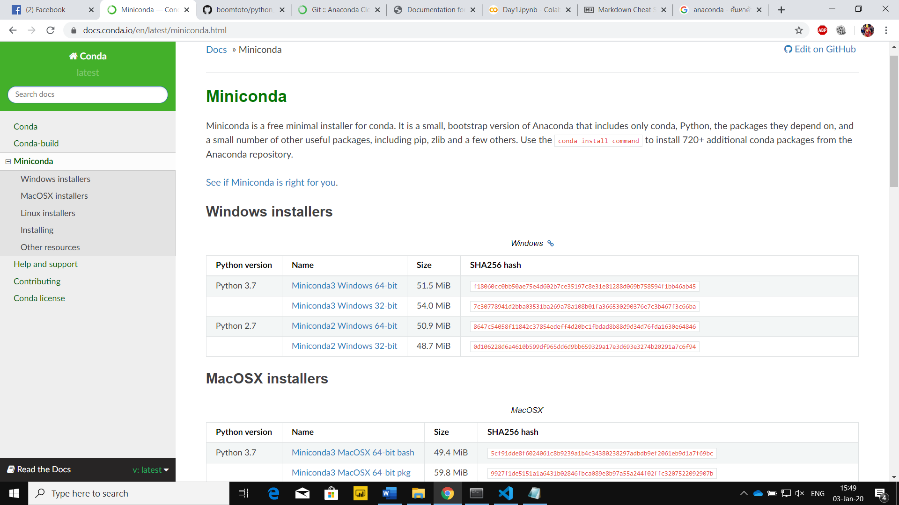
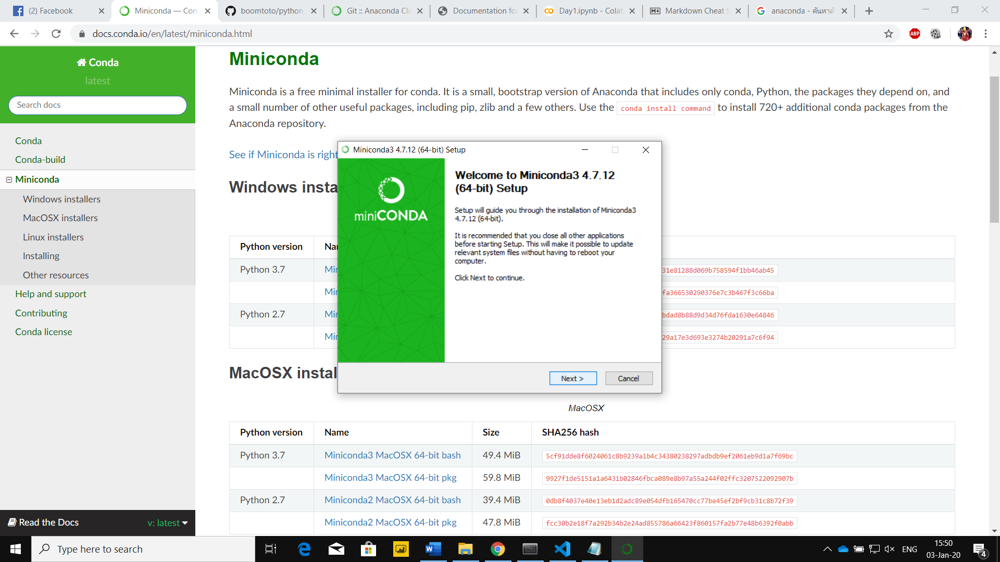
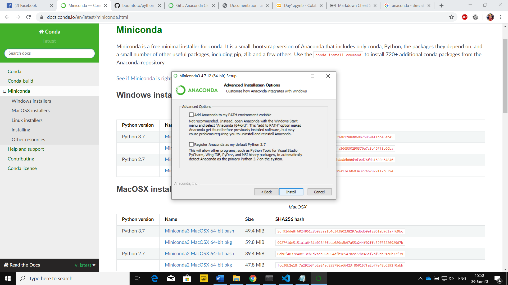
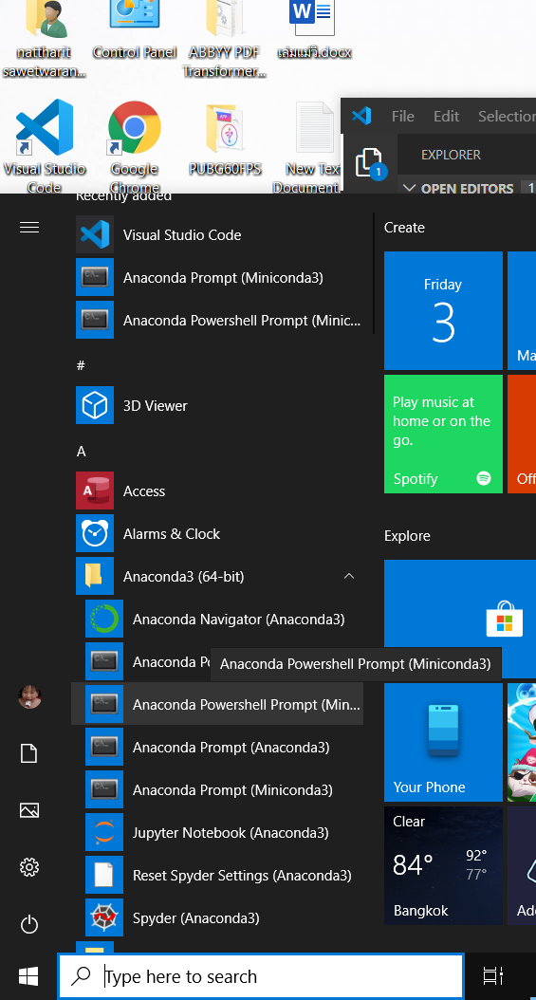
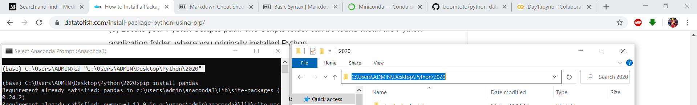
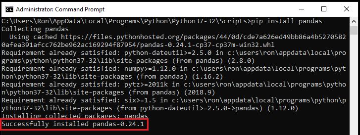
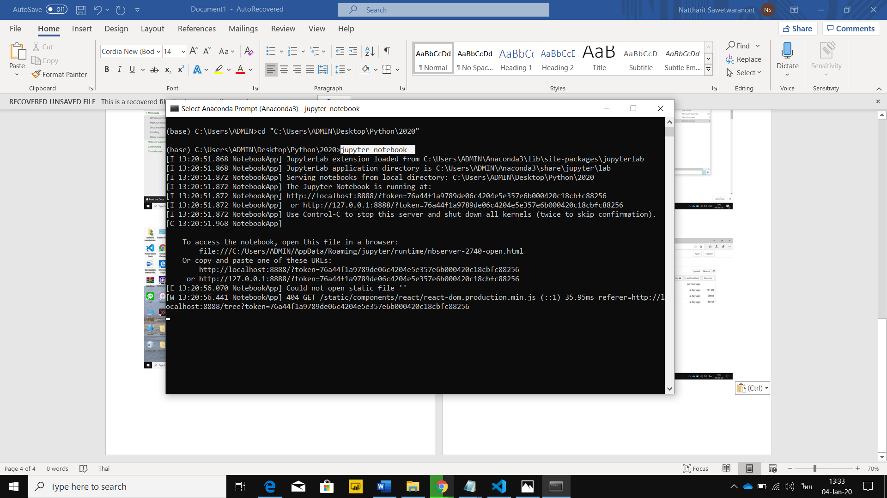
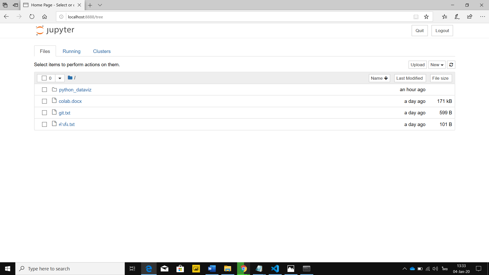
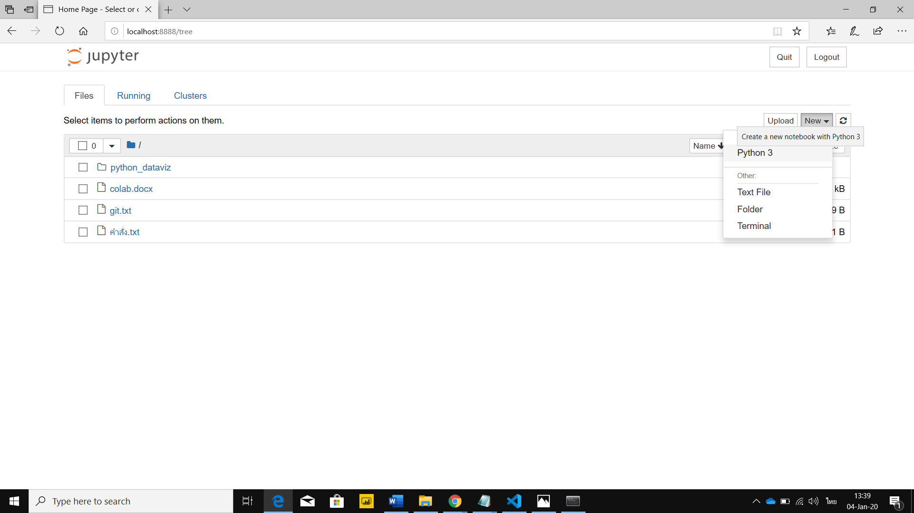
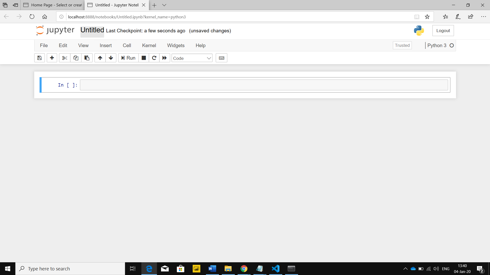

# python_dataviz

## นายณัฐฤทธิ์ เศวตวรานนท์

## 603021863-3 Sc-SI 

### วิธีลง miniconda

1. ทำการค้นหาคำว่า "miniconda" 

2. กดเว็ปแรกของผลการค้นหา จะทำให้เข้าสู่หน้าเว็ป conda สามารถกดเข้าได้จากตรงนี้ >> [กดตรงนี้](https://docs.conda.io/en/latest/miniconda.html)

 3. ให้เลือกระบบปฏิบัติการที่ตรงกับเครื่องที่ท่านใช้งานอยู่ แล้วทำการดาวน์โหลดจะได้ดังภาพข้างล่าง

** วิธีดูระบบปฏิบัติการเบื้องต้น
[กดตรงนี้](https://support.brother.com/g/b/faqend.aspx?c=th&lang=th&prod=dcpt300_all&faqid=faq00002859_000) **

 

4. กด Next ไปเรื่อยๆแล้วทำการ install 

5. Anaconda ที่ติดตั้งเรียบร้อยจะอยู่ตรงรูปธงวินโดดังภาพสามารถกดค้นหาได้ในช่อง serch 

6. เปิด Anaconda ใส่ที่อยู่ของ folder โดยใช้คำสั่ง cd "ที่อยู่folder" ดั้งภาพ

7. ทำการติดตั้งpackageต่างๆ เช่น จะติดตั้งpackage pandas จะใช้คำสั่ง pip install pandas และกด Enter เพื่อรันpackage และหากสำเร็จจะขึ้นตามภาพ

8. ทำการเปิดหน้า jupyter notebook 
พิมคำสั่ง jupyter notebook เพื่อเข้าใช้งาน

9. เมื่อใช้คำสั่ง jupyter notebook จะเด้งเข้ามาหน้านี้ทันที

10. ทำการกด new เลือก Python 3

11. สามารถเข้าใช้งานเพื่อเขียนคำสั่งต่างๆได้ สามารถเปบี่ยนชื่อที่มุมซ้ายบนและอื่นๆ

